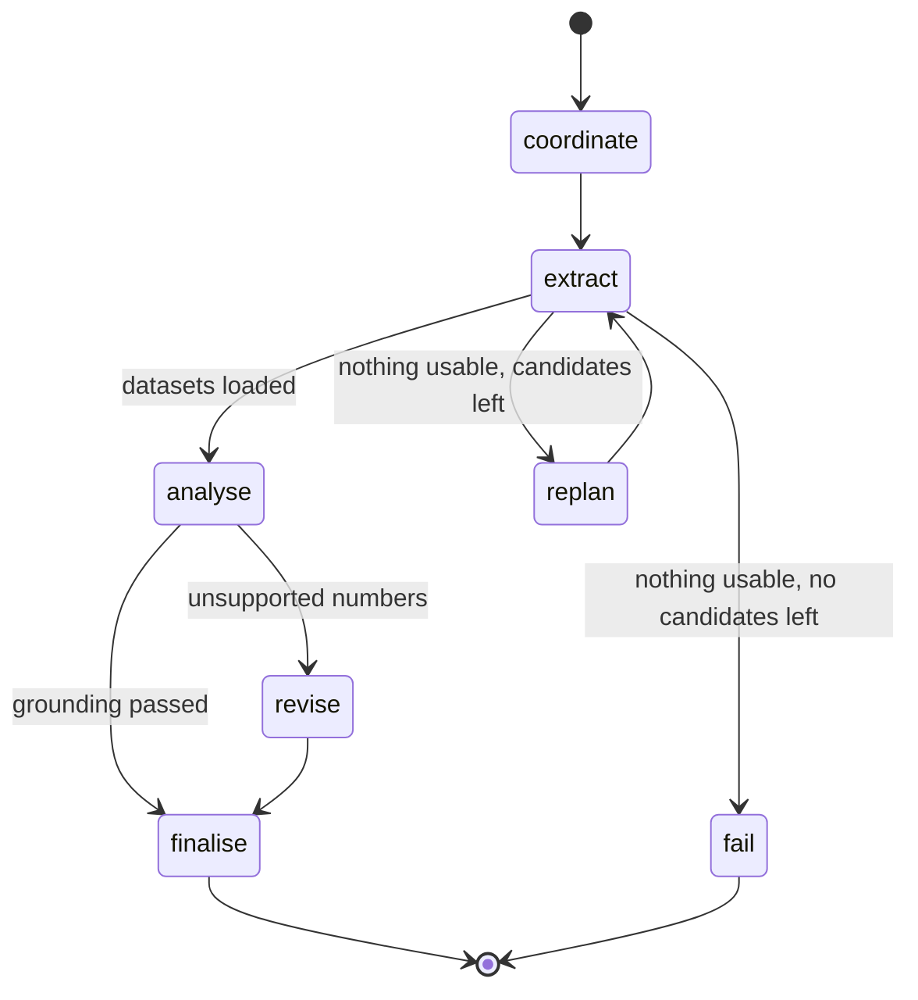

# Architecture

## Services

| Service | Port | Role |
| --- | --- | --- |
| web | 5173 | React dashboard. Submits queries, streams agent events, renders charts, quality checks, briefing and history. |
| api | 8000 | FastAPI. REST endpoints, WebSocket stream, background agent jobs, persistence. Runs the LangGraph agents. |
| gov-mcp | 8100 | Tool service for government data. `search_datasets` and `fetch_dataset`, plus a JSON-RPC `/mcp` endpoint. |
| bifrost | 8080 | OpenAI-compatible LLM gateway. Holds provider keys, routes to Gemini and falls back to Groq. |
| postgres | 5432 | Postgres 16 with pgvector. Conversations, analyses, agent events, dataset vectors, source chunks. |

```mermaid
flowchart TB
    subgraph Browser
        ui[React + Chakra + Recharts]
    end
    subgraph api[api service]
        rest[REST /api/analyses]
        ws[WebSocket /ws/analyses/id]
        job[Background job thread]
        graph[LangGraph agent graph]
        llm[LangChain client]
    end
    ui -- POST query --> rest
    rest -- create task --> job
    job --> graph
    graph -- emit events --> ws
    ws -- live and replayed events --> ui
    graph --> llm -- /v1/chat/completions --> bifrost[Bifrost]
    bifrost --> gemini[Gemini]
    bifrost -. on error .-> groq[Groq]
    graph -- search_datasets / fetch_dataset --> mcp[gov-mcp]
    mcp --> sources[Data.gov.sg / SingStat / internal Excel]
    job --> db[(Postgres + pgvector)]
    mcp --> db
```

## Request lifecycle

1. The browser posts `{query, conversation_id?}` to `POST /api/analyses`. The api stores the conversation and analysis rows, starts a background task and returns the analysis id immediately.
2. The browser opens `/ws/analyses/{id}`. Events already recorded are replayed first, so a late or reconnecting client never misses steps.
3. The background task runs `agents.run(query, emit)` in a worker thread. Every `emit(agent, step, content)` call is saved as an `agent_events` row and pushed to open sockets.
4. On success the result (plan, datasets, summary, report) is stored and a `done` message is broadcast. On failure the error is stored and an `error` message is broadcast. Both are also available from `GET /api/analyses/{id}`.

## Agent workflow

The agents are nodes in a LangGraph `StateGraph`. Each node reads and writes a shared `AgentState`, and conditional edges make the two decision points explicit.



| Agent | Reasoning (thought) | Tools and actions | Observations |
| --- | --- | --- | --- |
| Coordinator | Parses the year range and sector, decides search terms, explains its dataset choice | `search_datasets` over pgvector, keyword index and SingStat search; LLM planner with a `DatasetPlan` schema; cross-check rule | Candidate count and top matches, search failures, ambiguity notes |
| Extractor | States the fetch plan and fallback policy | `fetch_dataset` per planned dataset, then backup candidates, up to 4 attempts | Rows, grain, series count, quality result, notes such as snapshot fallback |
| Analytics | Explains the aggregation approach | pandas summary, correlations, LLM briefing with a `Briefing` schema, grounding check | Chart and metric counts, strongest correlation, provider, tokens, latency, grounding result |

This is the ReAct pattern: each agent emits a thought, takes an action with a tool, and records the observation before the graph decides the next node. The events are the audit trail shown in the "Agent activity" panel.

### Decisions and planning

- The coordinator's LLM may only choose keys from the candidate list. Invented keys are dropped, and a plan with no valid key raises and falls back to search ranking.
- If a plan uses a single provider, the coordinator adds the best-ranked dataset from another provider so findings can be cross-checked.
- If extraction returns nothing usable, the graph replans once with the next unused candidates.
- If the briefing contains numbers that are not in the computed facts, the graph revises once with the unsupported numbers as feedback. If the revision still fails, the deterministic template briefing is used.

### Failure handling

| Failure | Handling |
| --- | --- |
| Government API error or timeout | gov-mcp falls back to a bundled real snapshot for pinned datasets; otherwise the extractor tries the next candidate |
| gov-mcp unreachable | Coordinator uses the pinned datasets; the api loads their snapshots locally and notes it |
| Embedding provider rate limited | Request paths fail fast and pause embeddings for the retry window; search falls back to keyword ranking |
| LLM provider error | Bifrost retries on the fallback provider; if both fail, the planner uses search ranking and the briefing uses the template |
| Malformed LLM output | Pydantic parsing fails, and the same fallbacks apply |
| Hallucinated numbers | Grounding check, one revision, then template |
| Ambiguous question | Default datasets with a visible note asking for a topic |
| No usable data at all | The analysis is marked failed with a clear message |

## LLM layer

`app/llm/client.py` is a generic LangChain wrapper with no domain prompts. `complete(system, human, schema, variables)` builds a `ChatPromptTemplate`, calls a `ChatOpenAI` model pointed at Bifrost, parses the reply with `PydanticOutputParser`, and returns the parsed body, the provider that answered and token usage. The model id is `gemini/<GEMINI_MODEL>` with `extra_body={"fallbacks": ["groq/<GROQ_MODEL>"]}`, so fallback happens inside the gateway on a single request.

Prompts live with their agents: dataset planning in the coordinator and briefing in analytics. Adding a provider means adding it to Bifrost and to `chat_model_ids()`.

## Retrieval

Each fetched dataset is embedded once (title, agency, series names and measures) with `gemini-embedding-2` at 768 dimensions and stored in the `dataset_entries` table. Search ranks by cosine distance with pgvector, then mixes in keyword matches from the Data.gov.sg index, SingStat's own search and the internal source. If embeddings are unavailable, keyword ranking with synonyms is used. One embedding model is used everywhere so vectors are always comparable.

## Data model

| Table | Contents |
| --- | --- |
| `conversations` | Thread id, title, timestamps |
| `analyses` | Query, status, result JSON, error, conversation id |
| `agent_events` | Agent, step (thought, action, observation), content, timestamp |
| `dataset_entries` | Provider, dataset id, title, agency, coverage, detail text, 768-dimension embedding |
| `source_chunks` | Records used by each analysis, for traceability |

## Scalability

- The api does no heavy work on the event loop. Agent runs execute in worker threads, and the api is stateless apart from Postgres, so replicas can sit behind a load balancer. The load test sends 40 concurrent requests and checks p95 latency.
- gov-mcp scales separately from the api and isolates slow upstream APIs.
- Government responses are capped at 10,000 rows per fetch and reduced to at most 6 series and 40 periods per chart before reaching the LLM, which keeps prompts small (about 1,500 input tokens per briefing).
- For higher throughput, the background task can be moved to a queue such as Celery or Arq without changing the agent code, since `agents.run` is a plain function.
