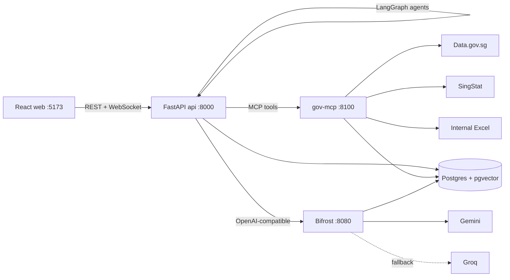
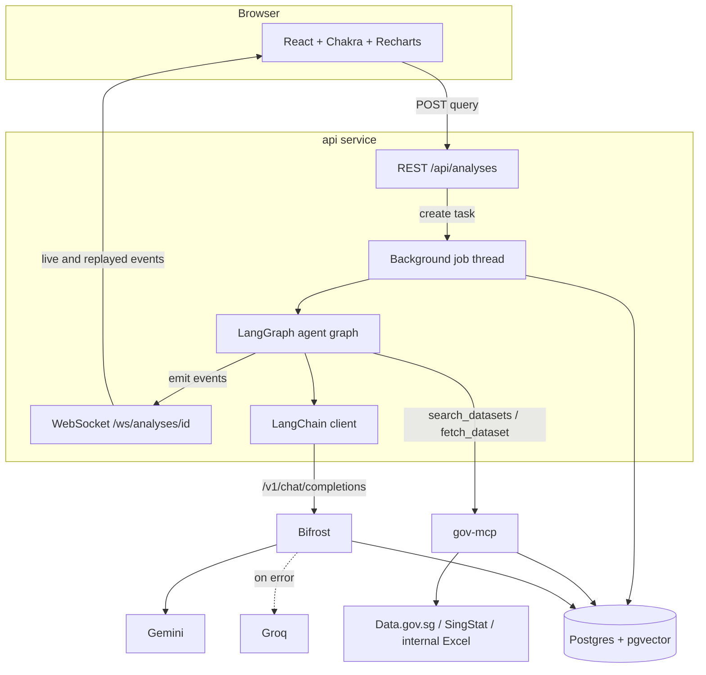
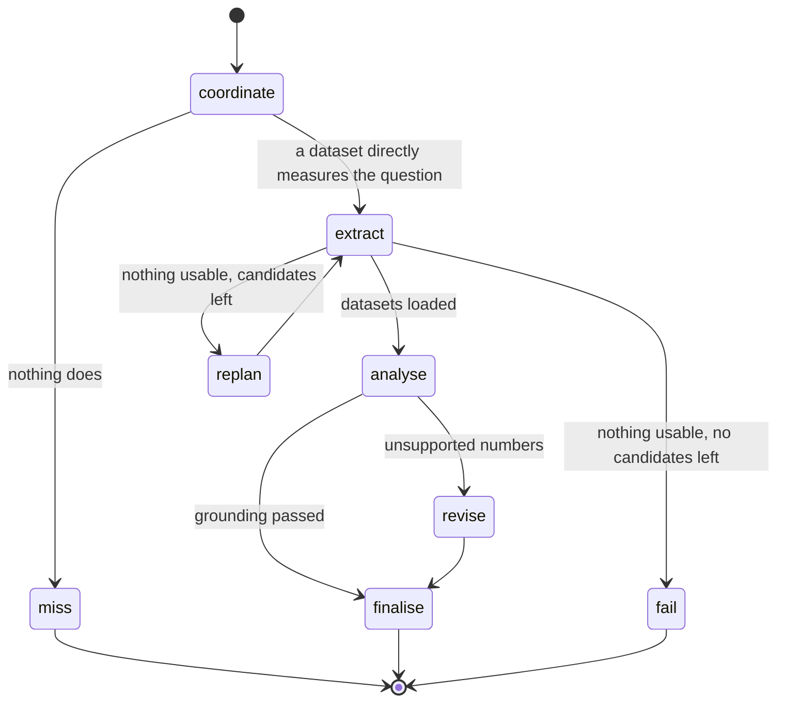

# Architecture

The api runs the agent graph in a background thread per request and streams every thought, action and observation to the browser. The gov-mcp service owns all government data access and exposes it as two tools, `search_datasets` and `fetch_dataset`. Bifrost holds the provider keys and handles provider fallback, so the application code only knows one OpenAI-compatible endpoint.

## Services

| Service | Port | Role |
| --- | --- | --- |
| web | 5173 | React dashboard. Submits queries, streams agent events, renders charts, quality checks, briefing and history. |
| api | 8000 | FastAPI. REST endpoints, WebSocket stream, background agent jobs, persistence. Runs the LangGraph agents. |
| gov-mcp | 8100 | Tool service for government data. `search_datasets` and `fetch_dataset`, plus a JSON-RPC `/mcp` endpoint. |
| bifrost | 8080 | OpenAI-compatible LLM gateway. Holds provider keys, routes to Gemini, falls back to Groq, and exposes request observability. |
| postgres | 5432 | Postgres 16 with pgvector. Stores application data and vectors, plus Bifrost configuration and LLM request logs in separate tables. |

## Request lifecycle

1. The browser posts `{query, conversation_id?}` to `POST /api/analyses`. The api stores the conversation and analysis rows, starts a background task and returns the analysis id immediately.
2. The browser opens `/ws/analyses/{id}`. Events already recorded are replayed first, so a late or reconnecting client never misses steps.
3. The background task runs `agents.run(query, emit)` in a worker thread. Every `emit(agent, step, content)` call is saved as an `agent_events` row and pushed to open sockets.
4. On success the result (plan, datasets, summary, report) is stored and a `done` message is broadcast. On failure the error is stored and an `error` message is broadcast. Both are also available from `GET /api/analyses/{id}`.

## Agent workflow

The agents are nodes in a LangGraph `StateGraph`. Each node reads and writes a shared `AgentState`, and conditional edges make the two decision points explicit.

| Agent | Reasoning (thought) | Tools and actions | Observations |
| --- | --- | --- | --- |
| Coordinator | Parses the year range and sector, asks the model what the question means, explains its dataset choice | `search_datasets` over pgvector, keyword index and SingStat search; LLM planner with a `DatasetPlan` schema | Candidate count and top matches, search failures, a refusal when nothing directly measures the question |
| Extractor | States the fetch plan and fallback policy | `fetch_dataset` per planned dataset, then backup candidates, up to 4 attempts | Rows, grain, series count, quality result, notes such as snapshot fallback |
| Analytics | Explains the aggregation approach | pandas summary, correlations, LLM briefing with a `Briefing` schema, grounding check | Chart and metric counts, strongest correlation, provider, tokens, latency, grounding result |

This is the ReAct pattern: each agent emits a thought, takes an action with a tool, and records the observation before the graph decides the next node. The events are the audit trail shown in the "Agent activity" panel.

### Decisions and planning

- The coordinator's LLM may only choose keys from the candidate list. Invented keys are dropped. An empty plan means none of the candidates directly measure the question, so nothing is charted. A plan that names only invented keys falls back to search ranking.
- If extraction returns nothing usable, the graph replans once with the next unused candidates.
- If the briefing contains numbers that are not in the computed facts, the graph revises once with the unsupported numbers as feedback. If the revision still fails, the deterministic template briefing is used.

### Failure handling

| Failure | Handling |
| --- | --- |
| Government API error or timeout | gov-mcp falls back to a bundled real snapshot for pinned datasets; otherwise the extractor tries the next candidate |
| gov-mcp unreachable | Coordinator uses the pinned datasets; the api loads their snapshots locally and notes it |
| Embedding provider rate limited | Bifrost tries Groq. If the vector that comes back is from a different model, or the call fails, search uses keyword ranking |
| LLM provider error | Bifrost retries on the fallback provider; if both fail, the planner uses search ranking and the briefing uses the template |
| Malformed LLM output | Pydantic parsing fails, and the same fallbacks apply |
| Hallucinated numbers | Grounding check, one revision, then template |
| Ambiguous question | Default datasets with a visible note asking for a topic |
| No usable data at all | The analysis is marked failed with a clear message |

## LLM layer

`app/llm/client.py` is a generic LangChain wrapper with no domain prompts. `complete(system, human, schema, variables)` builds a `ChatPromptTemplate`, calls a `ChatOpenAI` model pointed at Bifrost with a single model id (`gemini/<GEMINI_MODEL>`, or the first id from `chat_model_ids()`), parses the reply with `PydanticOutputParser`, and returns the parsed body, the provider that answered and token usage. Provider routing and failover stay in Bifrost's own configuration, so the client never names a fallback model.

Prompts live with their agents: dataset planning in the coordinator and briefing in analytics. Adding a provider means adding it to Bifrost and to `chat_model_ids()`.

Bifrost records each provider attempt in Postgres. Its dashboard on port 8080 shows status, provider, model, latency, input and output tokens, and estimated cost. A failed Gemini attempt and the successful Groq fallback are separate log rows linked to the same request flow, which makes provider failures visible even when the application receives a successful final response. Bifrost configuration is also stored in Postgres so dashboard changes persist across container restarts.

## Retrieval

The Data.gov.sg catalogue lives in `dataset_entries`. gov-mcp crawls it into Postgres and refreshes it when the copy is missing or older than 7 days. SingStat is still queried live.

Search uses one ranking method for that catalogue. Before it runs, the chat model reads the question and returns a few official phrases, such as reading EP as employment pass. Those phrases are what keyword search and, when vectors exist, the embedding query use. If the model is unavailable, search uses the words already in the question. When every row carries an embedding from the same model, pgvector orders them by cosine similarity. SingStat and the internal source are appended after those hits, on their own keyword scores. Until the embedding backfill finishes, or when the gateway is down, the catalogue is ranked by keyword score. Embeddings go through Bifrost (`gemini/gemini-embedding-2`, 768 dimensions), with Groq as the fallback. A query vector is used only when Bifrost returns the same model that embedded the rows.

## Data model

| Table | Contents |
| --- | --- |
| `conversations` | Thread id, title, timestamps |
| `analyses` | Query, status, result JSON, error, conversation id |
| `agent_events` | Agent, step (thought, action, observation), content, timestamp |
| `dataset_entries` | Provider, dataset id, title, agency, coverage, detail text, optional 768-dimension embedding and the model that produced it |
| `catalog_refresh` | When the Data.gov.sg catalogue was last crawled |
| `source_chunks` | Records used by each analysis, for traceability |

Bifrost owns its tables in the same database. The main request table is `logs`; gateway settings use `config_` tables, and governance uses `governance_` tables. The application does not read or write those tables directly.

## Scalability

- The api does no heavy work on the event loop. Agent runs execute in worker threads, and the api is stateless apart from Postgres, so replicas can sit behind a load balancer. The load test sends 40 concurrent requests and checks p95 latency.
- gov-mcp scales separately from the api and isolates slow upstream APIs.
- Government responses are capped at 10,000 rows per fetch and reduced to at most 6 series and 40 periods per chart before reaching the LLM, which keeps prompts small (about 1,500 input tokens per briefing).
- For higher throughput, the background task can be moved to a queue such as Celery or Arq without changing the agent code, since `agents.run` is a plain function.
