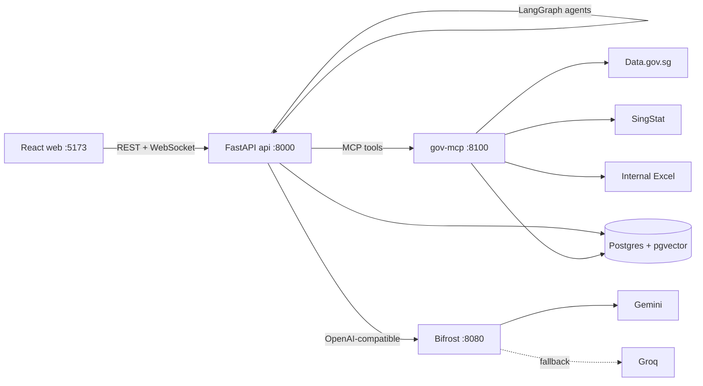

# SgStats

An agentic policy data analytics platform for Singapore public statistics. Ask a question in plain English, for example "Analyse employment trends in the technology sector from 2020-2024", and three cooperating agents find the right government datasets, fetch and clean them, run the statistics and write a cited briefing whose numbers are checked against the data.

Further reading:

- [ARCHITECTURE.md](ARCHITECTURE.md) for the system design and agent workflow
- [DATA_SOURCES.md](DATA_SOURCES.md) for the sources, formats and cleaning rules
- [TESTING.md](TESTING.md) for the test plan, hallucination checks and results

## Overview

| Area | What it does |
| --- | --- |
| Agents | Coordinator, Extractor and Analytics agents orchestrated as a LangGraph state graph with replan and revise loops |
| Sources | Data.gov.sg (JSON API, CSV snapshot), SingStat Table Builder (JSON API) and a mock internal database (Excel) |
| Analysis | Trends, change over time, Pearson correlations, robust outlier flags, data quality checks |
| LLMs | Gemini as primary and Groq as fallback, routed through a Bifrost gateway and called with LangChain |
| Reports | Briefing with insights, citations and a grounding check, exportable as Markdown, JSON or CSV |
| Frontend | React dashboard with live agent reasoning over WebSocket, charts, dataset quality and history |
| Retrieval | pgvector index of dataset descriptions with one embedding model (gemini-embedding-2, 768 dimensions) |

## Architecture



The api runs the agent graph in a background thread per request and streams every thought, action and observation to the browser. The gov-mcp service owns all government data access and exposes it as two tools, `search_datasets` and `fetch_dataset`. Bifrost holds the provider keys and handles provider fallback, so the application code only knows one OpenAI-compatible endpoint. See [ARCHITECTURE.md](ARCHITECTURE.md) for details.

## Setup

Prerequisites: Docker with Compose v2. For running tests outside Docker you also need [uv](https://docs.astral.sh/uv/) and Node 20 or newer.

1. Clone the repository and enter it.

   ```bash
   git clone <repo-url> SgStats && cd SgStats
   ```

2. Create the environment file and add your keys. A Gemini key is available free from Google AI Studio and a Groq key from the Groq console. Either one is enough to run; with both, Groq becomes the automatic fallback.

   ```bash
   cp .env.example .env
   # edit .env and set GEMINI_API_KEY and GROQ_API_KEY
   ```

   | Variable | Purpose | Default |
   | --- | --- | --- |
   | `GEMINI_API_KEY` | Gemini chat and embeddings | empty |
   | `GROQ_API_KEY` | Groq fallback chat | empty |
   | `GEMINI_MODEL` | Primary chat model | `gemini-3.5-flash` |
   | `GROQ_MODEL` | Fallback chat model | `openai/gpt-oss-120b` |
   | `FETCH_TIMEOUT` | Seconds per government API call | `12` |
   | `BIFROST_URL`, `MCP_URL`, `DATABASE_URL` | Service addresses, set by Compose | see `docker-compose.yml` |

3. Start the stack.

   ```bash
   docker compose up -d --build
   ```

4. Open http://localhost:5173. The API is at http://localhost:8000/docs and the Bifrost dashboard at http://localhost:8080.

Without any LLM key the platform still works. The coordinator falls back to search ranking and the analytics agent writes a template briefing from the computed facts. The UI shows this with a "via local" badge.

## Running locally

With Docker, the steps above are all you need. The web container mounts `frontend/` and reloads on change. Rebuild the Python services after backend changes:

```bash
docker compose up -d --build api gov-mcp
```

To run the backend without Docker, calling the government APIs directly, either start only Postgres with `docker compose up -d postgres` or clear `DATABASE_URL` in `.env` to use a local SQLite file (vector search then falls back to keyword search):

```bash
cd backend
uv sync
uv run uvicorn app.main:app --reload --port 8000
```

Then run the frontend in another shell. Vite proxies `/api` and `/ws` to port 8000.

```bash
cd frontend
npm install
npm run dev
```

To exercise the whole stack from the command line, the smoke script submits a query and prints every agent step, dataset, metric and the briefing:

```bash
python3 scripts/smoke.py "Analyse employment trends in the technology sector from 2020-2024"
cd scripts && python3 smoke_all.py   # all sample queries with a verdict each
```

## Running tests

```bash
cd backend
uv sync
uv run pytest                          # 102 tests, about 10 seconds, no network or keys needed
uv run pytest --cov --cov-report=term  # with coverage (80%)
LIVE_LLM_URL=http://localhost:8080 GEMINI_MODEL=gemini-3.5-flash GROQ_MODEL=openai/gpt-oss-120b \
  uv run pytest tests/test_llm.py -k live   # optional check against a running Bifrost

cd ../frontend
npm run typecheck && npm run build
```

CI runs the same backend and frontend checks plus a `docker compose build` on every push and pull request (`.github/workflows/ci.yml`). [TESTING.md](TESTING.md) explains the test plan and the hallucination checks.

## Sample queries

| Query | What it shows |
| --- | --- |
| Analyse employment trends in the technology sector from 2020-2024 | Two SingStat tables plus the internal Excel source, correlations across sources |
| How has CPI inflation changed since 2019 | SingStat CPI with a Data.gov.sg price index as a cross-check |
| How many total EP workers in Singapore from 2020 to current | Foreign workforce by pass type from Data.gov.sg |
| HDB resale prices from 2015 to 2024 | Large transactional dataset aggregated to a time series |
| Births and fertility trends in Singapore | Demographic series without explicit years |
| tell me something | Ambiguous question: default datasets with an explanatory note |

To see failure handling, run `docker compose stop gov-mcp` and submit a query. The coordinator reports that search failed, the extractor loads the bundled real snapshots, and the briefing states that the data service was unreachable. Run `docker compose start gov-mcp` to restore it.

## Technology choices

| Choice | Why |
| --- | --- |
| LangGraph on LangChain | The workflow has real branches (replan when extraction fails, revise when grounding fails). A state graph makes those decisions explicit, testable and visible, while LangChain supplies prompt templates, structured output parsing and a provider-neutral chat model. |
| Bifrost gateway | Provider keys and fallback order live in one service instead of every caller. Swapping or adding a provider is a config change, and the gateway dashboard gives request logs and token counts. |
| Gemini and Groq | Two independent providers with free tiers. Gemini is the primary for quality and Groq is a fast fallback when Gemini is rate limited. |
| MCP-style gov-mcp service | Data access is isolated behind two tools with a JSON contract, so other agents or clients can reuse it, and a slow government API cannot block the api process. |
| FastAPI | Async REST and WebSocket in one framework, with request validation from Pydantic and generated OpenAPI docs. |
| Postgres with pgvector | One database for analyses, agent events, conversation history and the dataset vector index, instead of running a separate vector store. |
| pandas | Reliable reshaping, grouping and statistics for tabular government data in CSV, Excel and JSON. |
| React, Vite, Chakra UI, Recharts | Fast development build, accessible components themed to the Singapore government developer portal, and simple declarative charts. |
| uv and Docker Compose | Locked, reproducible Python installs and a one-command local stack. |

## Project layout

```text
backend/app/agents/      coordinator, extractor and analytics agents plus the LangGraph pipeline
backend/app/llm/         generic LangChain client (no domain prompts)
backend/app/gov/         catalog search, fetching, normalisation, statistics, embeddings
backend/app/core/        settings and the SQLAlchemy store
backend/app/main.py      REST and WebSocket API
backend/data/            dataset index, real snapshots, mock internal workbook
backend/tests/           unit, integration, LLM, data quality and performance tests
mcp/server.py            gov-mcp tool service
frontend/src/            React dashboard
scripts/                 smoke test, snapshot refresh, mock data generator
```

## Secrets and deployment

Keys are read from `.env`, which is git-ignored. Only `.env.example` with empty values is committed, and the Bifrost config references keys through `env.` variables. For deployment, build the same images and supply the variables through the platform's secret store (for example Azure Container Apps secrets, AWS Secrets Manager or Kubernetes secrets). Point `DATABASE_URL` at a managed Postgres with the `vector` extension enabled, and run api and gov-mcp as separate services so they can scale independently. The api is stateless apart from Postgres, so it can run as several replicas behind a load balancer; WebSocket clients that reconnect to another replica receive a replay of stored events.
