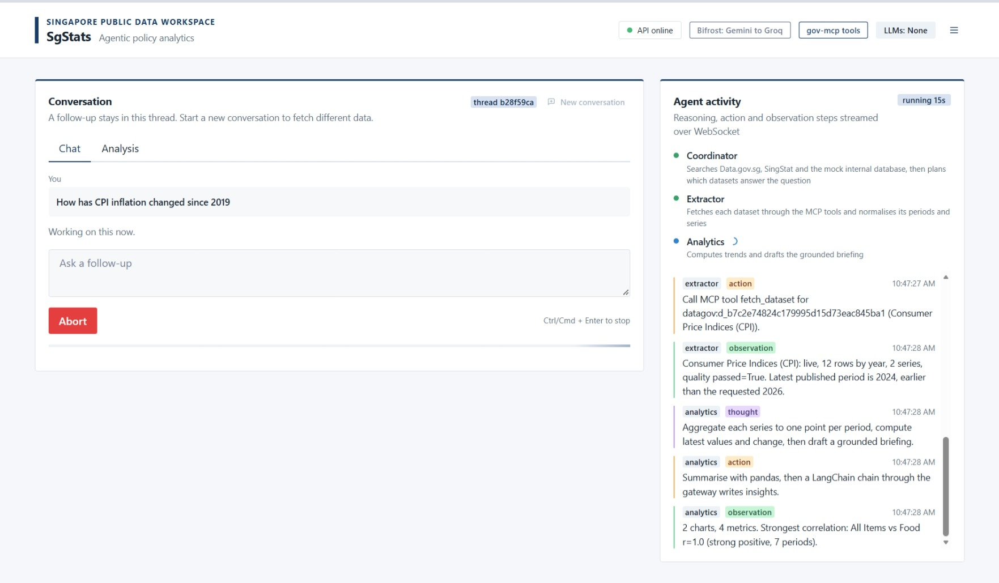
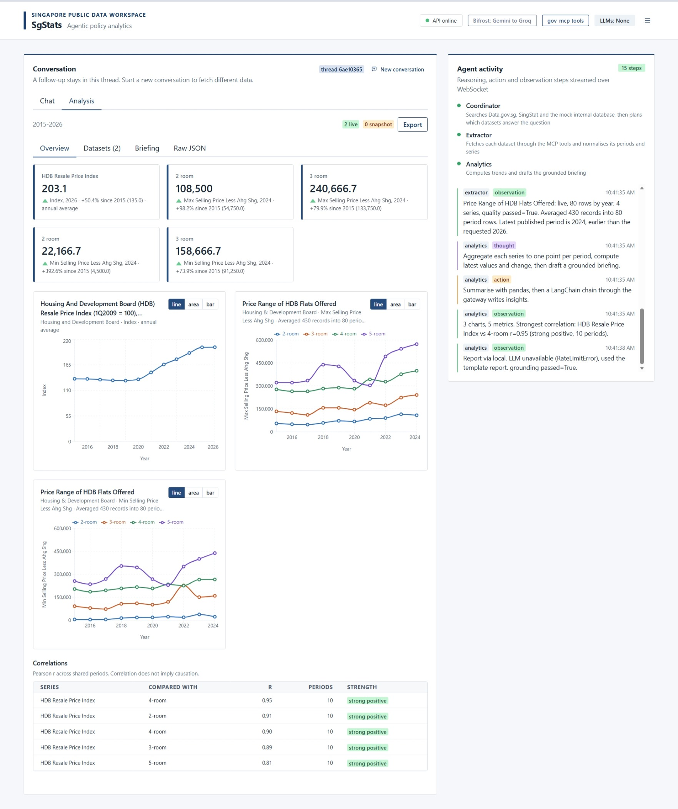
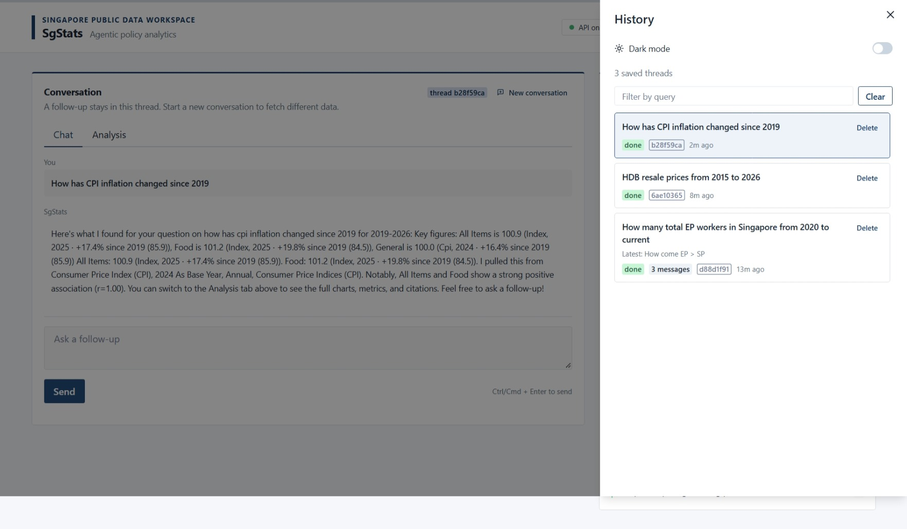
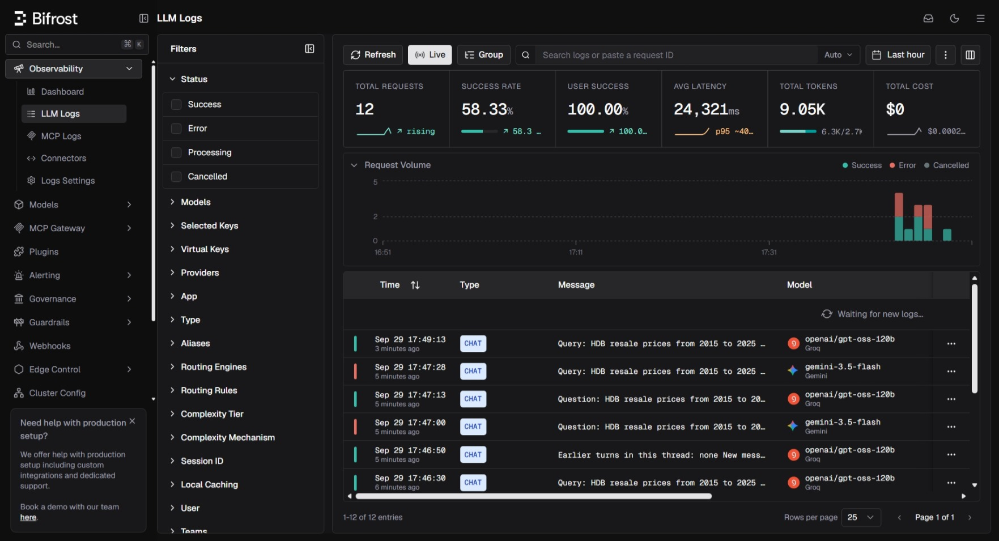
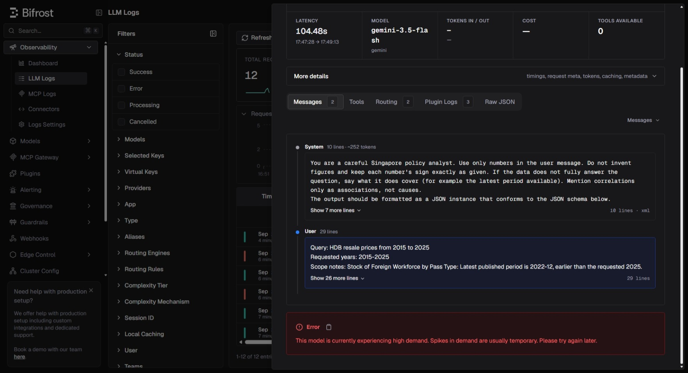
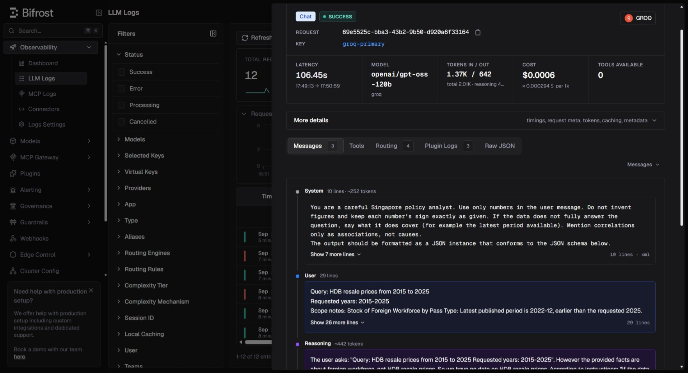

# SgStats

An agentic policy data analytics platform for Singapore public statistics. Ask a question in plain English, for example "Analyse employment trends in the technology sector from 2020-2024", and three cooperating agents find the right government datasets, fetch and clean them, run the statistics and write a cited briefing whose numbers are checked against the data.

[](https://skillicons.dev) [](https://skills.syvixor.com) [](https://skillicons.dev)

Go to [WHY.md](WHY.md) to see my actual thoughts.

Further reading:

- [ARCHITECTURE.md](ARCHITECTURE.md) for the system design and agent workflow
- [DATA_SOURCES.md](DATA_SOURCES.md) for the sources, formats and cleaning rules
- [TESTING.md](TESTING.md) for the test plan, hallucination checks and results
- [WHY.md](WHY.md) for the technology choices and design reasons

## Overview

| Area | What it does |
| --- | --- |
| Agents | Coordinator, Extractor and Analytics agents orchestrated as a LangGraph state graph with replan and revise loops |
| Sources | Data.gov.sg (JSON API, CSV snapshot), SingStat Table Builder (JSON API) and a mock internal database (Excel) |
| Analysis | Trends, change over time, Pearson correlations, robust outlier flags, data quality checks |
| LLMs | Gemini as primary and Groq as fallback, routed through a Bifrost gateway and called with LangChain |
| Reports | Briefing with insights, citations and a grounding check, exportable as Markdown, JSON or CSV |
| Frontend | React dashboard with live agent reasoning over WebSocket, charts, dataset quality and history |
| Retrieval | Data.gov.sg catalogue in Postgres. The chat model turns the question into search phrases. Keyword search, or pgvector once Bifrost has embedded every row |

## Setup

Prerequisites: Docker with Compose v2. For running tests outside Docker you also need [uv](https://docs.astral.sh/uv/) and Node 20 or newer.

1. Clone the repository and enter it.

   ```bash
   git clone <repo-url> SgStats && cd SgStats
   ```

2. Create the environment file and add your keys. A Gemini key is available free from Google AI Studio and a Groq key from the Groq console. Either one is enough to run; with both, Groq becomes the automatic fallback.

   ```bash
   cp .env.example .env
   # edit .env and set GEMINI_API_KEY and GROQ_API_KEY
   ```

   | Variable | Purpose | Default |
   | --- | --- | --- |
   | `GEMINI_API_KEY` | Gemini chat and embeddings | empty |
   | `GROQ_API_KEY` | Groq fallback chat | empty |
   | `GEMINI_MODEL` | Primary chat model | `gemini-3.5-flash` |
   | `GROQ_MODEL` | Fallback chat model | `openai/gpt-oss-120b` |
   | `FETCH_TIMEOUT` | Seconds per government API call | `12` |
   | `BIFROST_URL`, `MCP_URL`, `DATABASE_URL` | Service addresses, set by Compose | see `docker-compose.yml` |

3. Start the stack.

   ```bash
   docker compose up -d --build
   ```

4. Open http://localhost:5173. The API is at http://localhost:8000/docs and the Bifrost dashboard at http://localhost:8080.

Without any LLM key the platform still works. The coordinator falls back to search ranking and the analytics agent writes a template briefing from the computed facts. The UI shows this with a "via local" badge.

## Running locally

With Docker, the steps above are all you need. The web container mounts `frontend/` and reloads on change. Rebuild the Python services after backend changes:

```bash
docker compose up -d --build api gov-mcp
```

To run the backend without Docker, calling the government APIs directly, either start only Postgres with `docker compose up -d postgres` or clear `DATABASE_URL` in `.env` to use a local SQLite file (vector search then falls back to keyword search):

```bash
cd backend
uv sync
uv run uvicorn app.main:app --reload --port 8000
```

Then run the frontend in another shell. Vite proxies `/api` and `/ws` to port 8000.

```bash
cd frontend
npm install
npm run dev
```

## Running tests

```bash
cd backend && uv sync && uv run pytest
cd frontend && npm run typecheck && npm run build
```

The suite needs no network or API keys and finishes in about 10 seconds. [TESTING.md](TESTING.md) covers the plan, hallucination checks and results.

## Sample queries

| Query | What it shows |
| --- | --- |
| Analyse employment trends in the technology sector from 2020-2024 | Two SingStat tables plus the internal Excel source, correlations across sources |
| How has CPI inflation changed since 2019 | SingStat CPI with a Data.gov.sg price index as a cross-check |
| How many total EP workers in Singapore from 2020 to current | Foreign workforce by pass type from Data.gov.sg |
| HDB resale prices from 2015 to 2024 | Large transactional dataset aggregated to a time series |
| Births and fertility trends in Singapore | Demographic series without explicit years |
| tell me something | Ambiguous question: default datasets with an explanatory note |

To see failure handling, run `docker compose stop gov-mcp` and submit a query. The coordinator reports that search failed, the extractor loads the bundled real snapshots, and the briefing states that the data service was unreachable. Run `docker compose start gov-mcp` to restore it.

## Screenshots

A question in progress. The send button becomes Abort, and agent steps stream in on the right:



Finished analysis, with metrics, charts and the agent log:



The Chat tab keeps the written reply and the follow-up box:



Bifrost logs every model call. Here Gemini failed and Groq answered the same request:



Open a red Gemini row to see the provider error. This one is a 503 because the model was under high demand:



The green Groq row for that same call shows the fallback reply, with token counts and cost:


